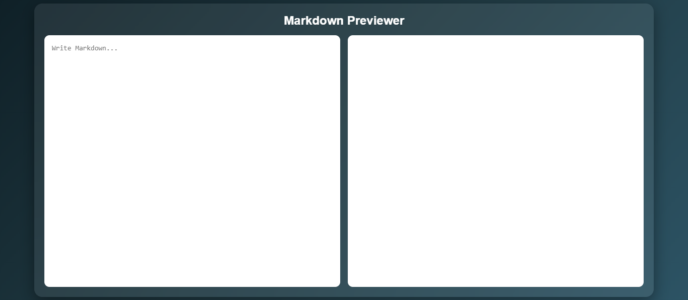
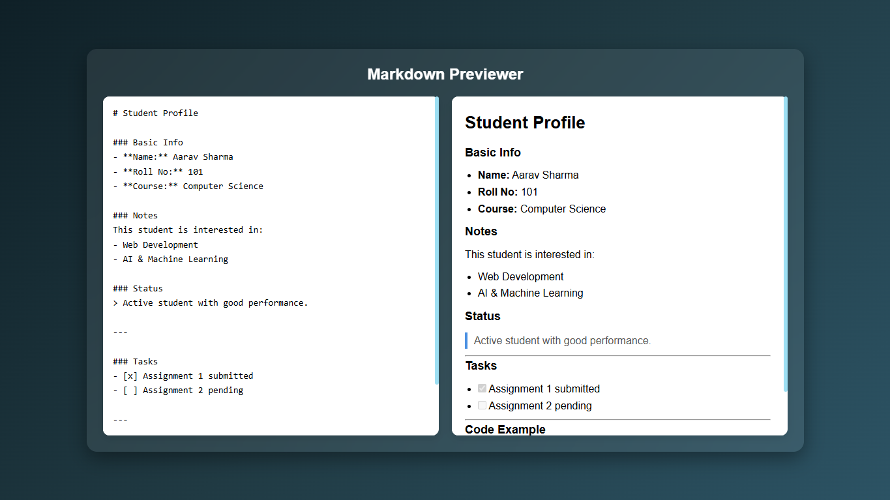

# Markdown Previewer

## Description
A real-time Markdown previewer that allows users to write Markdown syntax and instantly see the formatted output. Useful for developers and writers to visualize Markdown content quickly.

## Screenshots

## Features
- Live preview while typing
- Supports standard Markdown syntax (headings, lists, code, etc.)
- Split-screen editor and preview layout
- Clean and responsive UI

## Tech Stack
- HTML
- CSS
- JavaScript
- Marked.js (for Markdown parsing)

## How to Run
1. Clone the repository
2. Open `index.html` in your browser
3. Start typing Markdown in the editor

## Future Improvements
- Add syntax highlighting for code blocks
- Add dark/light mode toggle
- Add export as HTML feature
- Add toolbar shortcuts for Markdown formatting
